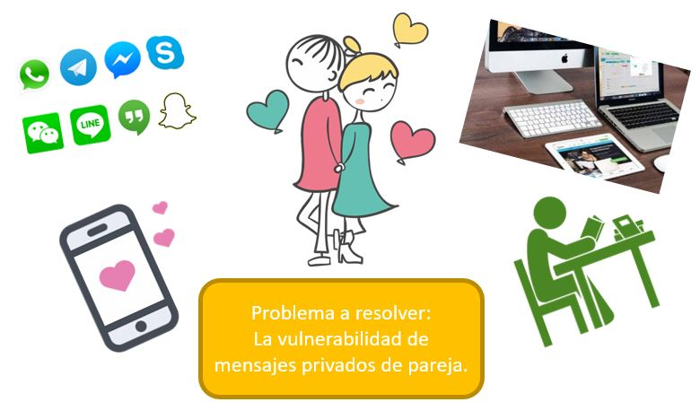

# Cifrado César

## Proceso de diseño
Para definir mi producto final a nivel de experiencia y de interfaz seguí los siguientes pasos del proceso de diseño:

### Descubrimiento e investigación

Los usuarios principales de mi producto son las parejas de novios o enamorados (o quienes tienen a alguien especial) que desean escribirse y que desean proteger la intimidad de algunos de sus mensajes, o quizá mandar algún mensaje secreto.
Existen aplicaciones de mensajería instantánea que facilitan en cierta forma la comunicación de pareja, pero no hay cómo proteger esos mensajes. A lo que me refiero es, por ejemplo, si en algún momento debemos prestar nuestro dispositivo (celular, laptop) a otra persona, o si nos lo roban, corremos el riesgo de que puedan ver lo que le escribimos a nuestra pareja, y más si algunos mensajes son de carácter privado.
En conclusión, lo que más desearía la mayoría de parejas es privacidad y proteger la intimidad de sus mensajes.

### Síntesis y definición

¿Qué queremos resolver de nuestros usuarios?

La imagen representa a un arquetipo de nuestros usuarios: una pareja de enamorados llamados Luis y Rosa.
Ellos comparten gustos afines; dispositivos tecnológicos como una computadora, laptop, tablet o celular forman parte de su día a día, ya sea para comunicarse o hacer trabajos de la universidad. Ya que no siempre pueden verse por los horarios de clases, las aplicaciones de mensajería instantánea como WhatsApp y Facebook Messenger les son muy útiles para comunicarse y mostrarse afecto así sean solo palabras.
Como la mayoría de parejas, ellos desean escribirse mensajes especiales que nadie más pudiese leer, y les ha pasado más de una vez que al prestar su celular a algún amigo o amiga, sus mensajes son vistos de casualidad o a propósito, causando un poco de incomodidad en Rosa y Luis. Rosa, en particular, no confía totalmente en la privacidad que ofrecen estas aplicaciones, y piensa que sería buenos tener algunas conversaciones con Luis que solo los dos puedan entender y saber.

### Ideación

Si nuestros usuarios desean tener mensajes que solo ellos puedan entender, se nos viene a la mente el concepto de cifrado, y así pude trabajar entendiendo el proceso de cifrado y cómo plasmarlo en una interfaz amigable que el usuario pueda entender y gustarle.

### Prototipado

Elaboré un prototipo práctico, ya que nuestro usuarios desean obtener los mensajes rápido, así como un traductor de idioma.
En el encabezado va un título, luego las indicaciones para el usuario, un input para el offset (número de desplazamiento de letras), un textarea para ingresar el mensaje que se desea cifrar, dos botones para que cifre o descifre, y finalmente el resultado deseado (texto cifrado o descifrado).

## Conclusiones

- Quiénes son los principales usuarios de producto.

  Los principales usuarios son las parejas de enamorados o novios.

- Cuáles son los objetivos de estos usuarios en relación con tu producto.

  Los objetivos son que los usuarios puedan disfrazar sus mensajes especiales y mandarselos, y que solo ellos sepan su significado.

- Cómo crees que el producto que estás creando está resolviendo sus problemas.

   Mediante el cifrado y descifrado, ellos tendrían su mensaje original y cifrado a la mano, y luego lo pueden copiar y pegar a su chat de preferencia, pueden mandarse los mensajes que deseen y nadie más podrá saber qué es lo que se escriben.

## Contexto: Cifrado César

Cifrar significa codificar. El [cifrado César](https://en.wikipedia.org/wiki/Caesar_cipher) es uno de los primeros métodos de cifrado conocidos. El emperador romano Julio César lo usaba para enviar órdenes secretas a sus generales en los campos de batalla.

El cifrado césar es una de las técnicas más simples para cifrar un mensaje. Es un tipo de cifrado por sustitución, es decir que cada letra del texto original es reemplazada por otra que se encuentra un número fijo de posiciones (desplazamiento) más adelante en el mismo alfabeto.

Por ejemplo, si usamos un desplazamiento (_offset_) de 3 posiciones:

- La letra A se cifra como D.
- La palabra CASA se cifra como FDVD.
- Alfabeto sin cifrar: A B C D E F G H I J K L M N O P Q R S T U V W X Y Z
- Alfabeto cifrado: D E F G H I J K L M N O P Q R S T U V W X Y Z A B C

En la actualidad, todos los cifrados de sustitución simple se descifran con mucha facilidad y, aunque en la práctica no ofrecen mucha seguridad en la comunicación por sí mismos; el cifrado César sí puede formar parte de sistemas más complejos de codificación, como el cifrado Vigenère, e incluso tiene aplicación en el sistema ROT13.
